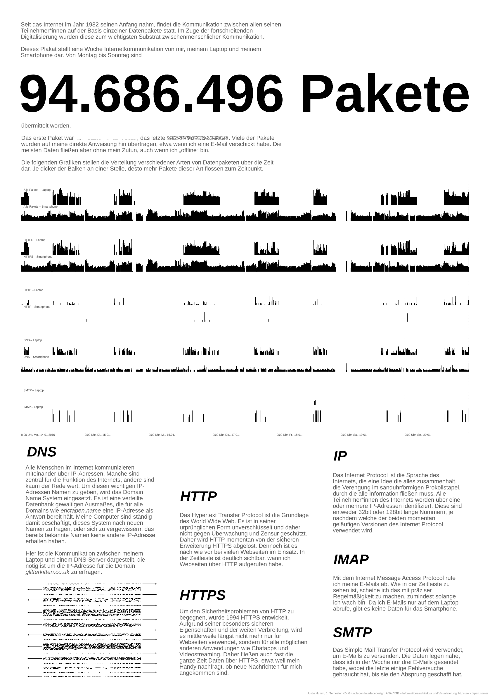

# 94.686.496 Pakete

Ein Poster, das eine Woche Internetverkehr von meinem Laptop und Smartphone darstellt.

Veröffentlicht wird hier nur der Code, nicht aber die Rohdaten. Einzige Ausnahmen sind ein paar ausgewählte IP-Pakete, die auf dem Plakat sowieso voll zu sehen sind.



Die Dateien `plakat_mit_text_final.pdf` und `plakat_ohne_text_final.pdf` (Text als Pfade) bilden die fertige Abgabe.


## Building

Benötigt werden `cargo`, `rustc` und `inkscape`. [Nix](https://nixos.org/nix)-User können mit `nix-shell` bequem alle Dependencies temporär installieren.

Zum generieren des Plakates dann

```
cargo build
./target/debug/plakat
```

ausführen. Das Ergebnis liegt dann in template.svg (in diesem Fall natürlich ohne die meisten Diagramme, weil die Rohdaten nicht im Repo liegen).
